# Butir Soal

---

## LEVEL 1

### Soal 1
**Perhatikan gambar berikut selama 15 detik!**

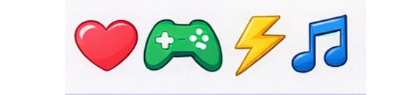

Susun kembali urutan simbol tersebut!

- A. Petir, musik, Hati, stik
- B. Stik, musik, Hati, petir
- **C. Hati, stik, petir, musik ✓**
- D. Hati, petir, stik, musik

---

### Soal 2
**Ingat urutan angka pada simbol berikut!**

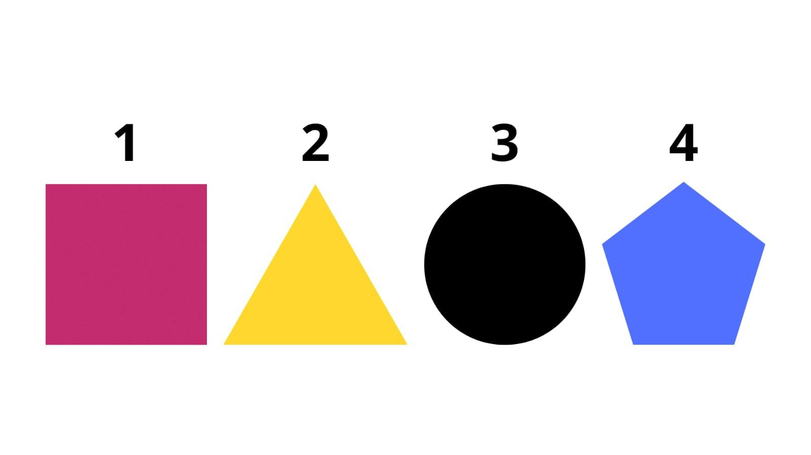

Pilihlah urutan angka pada simbol yang sesuai!

- A. 4, 2, 3, 1
- **B. 1, 2, 3, 4 ✓**
- C. 2, 1, 3, 4
- D. 1, 3, 4, 2

---

### Soal 3
**Perhatikan gambar dibawah ini dan ingatlah urutan gambar tersebut!**

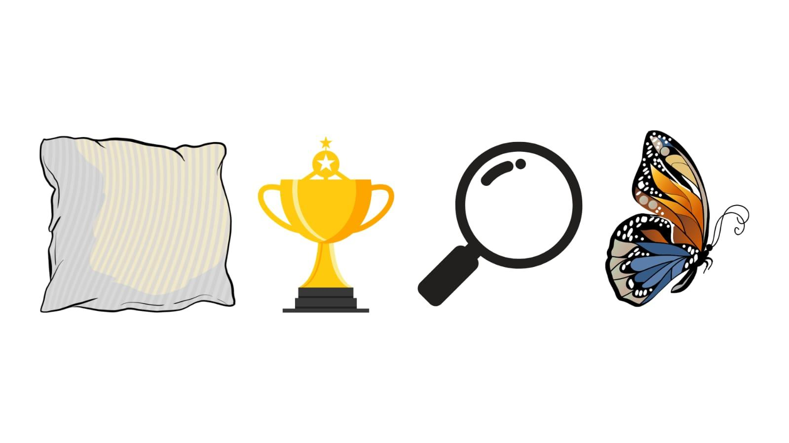

Pilihlah urutan yang sesuai berdasarkan gambar diatas!

- A. Piala, kaca pembesar, bantal, kupu-kupu
- B. Bantal, piala, kupu-kupu, kaca pembesar
- **C. Bantal, piala, kaca pembesar, kupu-kupu ✓**
- D. Kaca pembesar, piala, bantal, kupu-kupu

---

### Soal 4
**Perhatikan urutan ikon dibawah ini!**

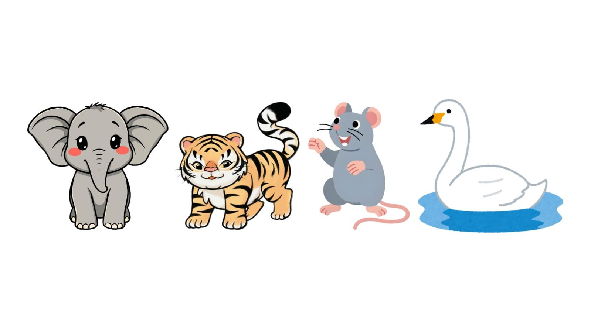

Masukkan kembali urutan yang benar!

- A. Harimau, angsa, tikus, gajah
- B. Angsa, harimau, tikus, gajah
- C. Gajah, angsa, harimau, tikus
- **D. Gajah, harimau, tikus, angsa ✓**

---

### Soal 5
**Ingatlah urutan playlist lagu berikut!**

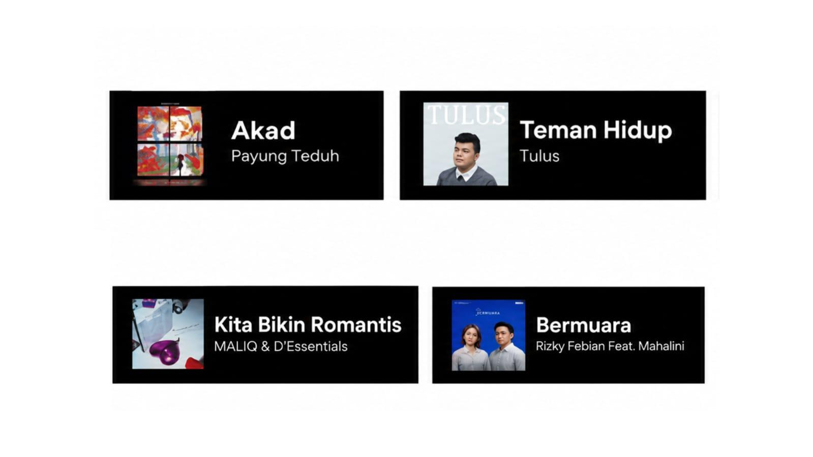

Urutkan playlist tersebut berdasarkan nama penyanyinya!

- A. Tulus, Maliq, Rizky Febian, Payung Teduh
- **B. Payung Teduh, Tulus, Maliq, Rizky Febian ✓**
- C. Payung Teduh, Tulus, Rizky Febian, Maliq
- D. Maliq, Tulus, Payung Teduh, Rizky Febian

---

### Soal 6
**Perhatikan urutan media sosial dibawah ini!**

Ketik ulang urutan media sosial tersebut!

- A. Instagram, Tiktok, Whatsapp, Facebook
- **B. Instagram, Tiktok, Facebook, Whatsapp ✓**
- C. Tiktok, Instagram, Whatsapp, Facebook
- D. Whatsapp, Tiktok, Facebook, Instagram

---

### Soal 7
**Perhatikan aktivitas dibawah ini!**

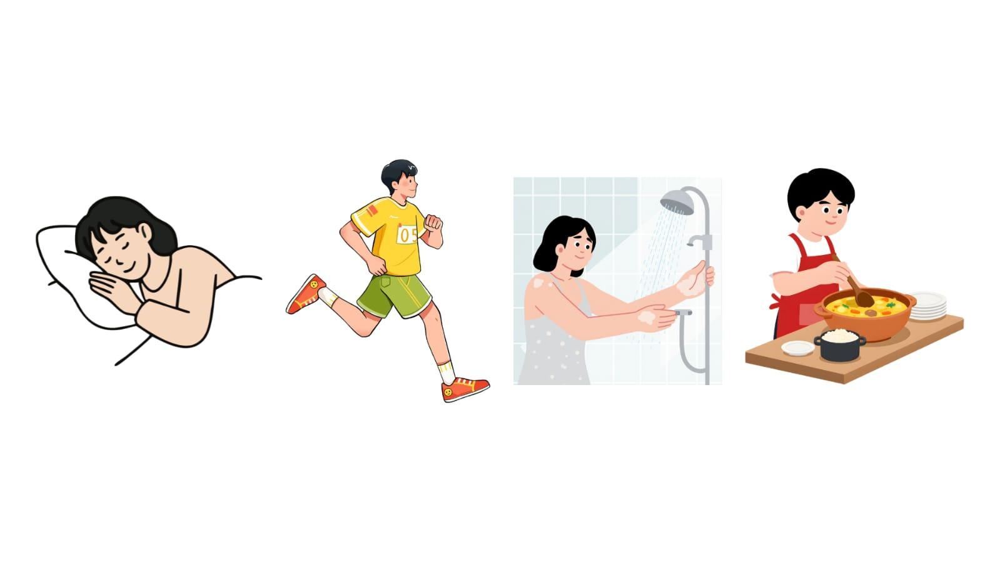

Tuliskan kembali urutan aktivitas anda untuk memulai aktifitas dipagi hari!

- **A. tidur – lari pagi – mandi – memasak ✓**
- B. Mandi – memasak – tidur – lari pagi
- C. Tidur – lari pagi – memasak – mandi
- D. Lari pagi – tidur – mandi – memasak

---

### Soal 8
**Perhatikan dan ingatlah gambar transportasi berikut!**

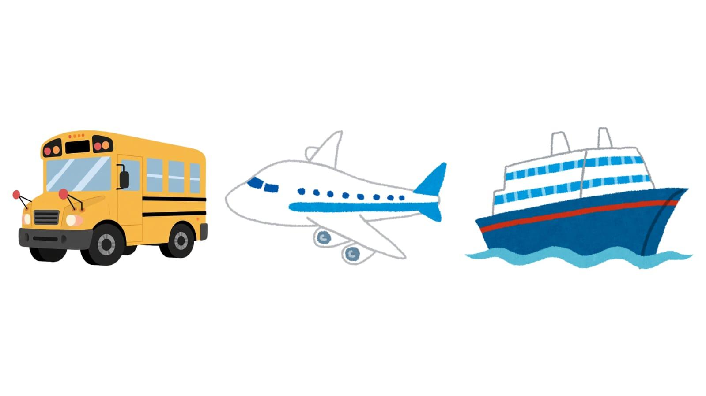

Urutkan beberapa transportasi dari darat, udara, dan air tersebut!

- A. Kapal, bus, pesawat
- **B. Bus, pesawat, kapal ✓**
- C. Kapal, pesawat, bus
- D. Pesawat, bus, kapal

---

### Soal 9
**Ingatlah beberapa urutan lampu rambu lalu lintas berikut!**

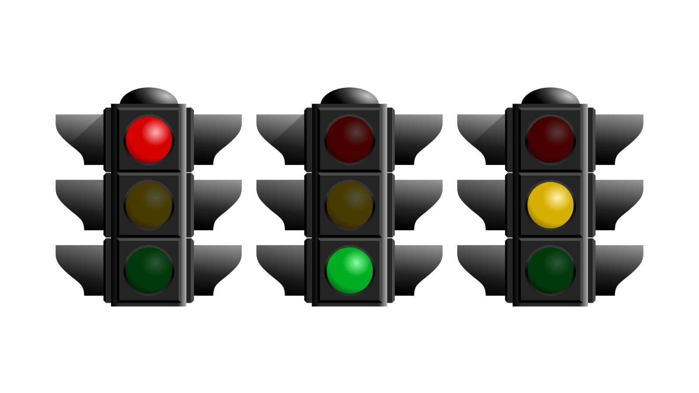

Pilihlah urutan warna lampu lalu lintas yang sesuai gambar tersebut!

- A. 🟠🔴🟢
- **B. 🔴🟢🟠 ✓**
- C. 🔴🟠🟢
- D. 🟢🔴🟠

---

### Soal 10
**Perhatikan beberapa kondisi cuaca berikut!**

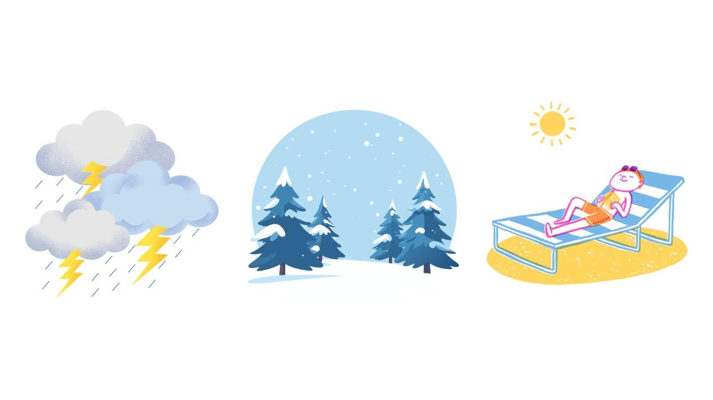

Pilihlah urutan kondisi cuaca yang benar dari gambar diatas!

- **A. Badai, bersalju, cerah ✓**
- B. Cerah, badai, bersalju
- C. Bersalju, cerah, badai
- D. Cerah, bersalju, badai

---

## LEVEL 2

### Soal 1
**Perhatikan dan ingat hanya huruf yang berwarna merah**

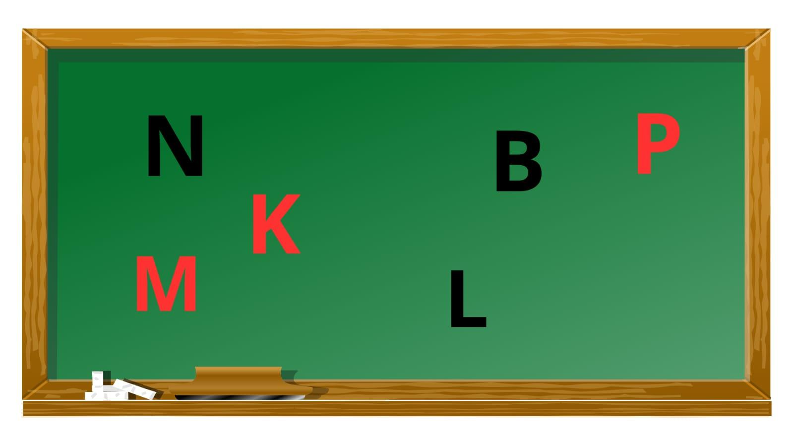

Sebutkan kembali huruf-huruf berwarna merah tersebut

- A. K, P, M
- B. M, P, K
- **C. M, K, P ✓**
- D. K, M, P

---

### Soal 2
**Perhatikan dan ingat hanya benda yang terbuat dari kayu**

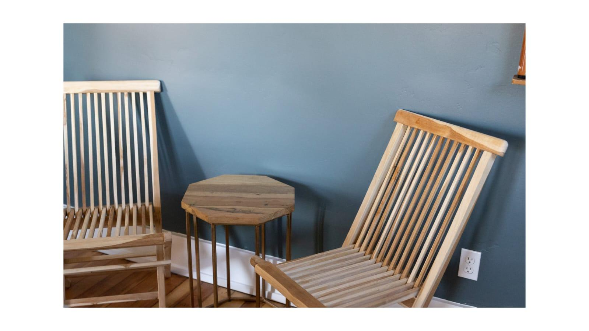

- A. Dinding, Kursi
- B. Pensil, Meja
- **C. Meja, Kursi ✓**
- D. Pensil, Kayu

---

### Soal 3
**Fokus dan ingat hanya angka genap**

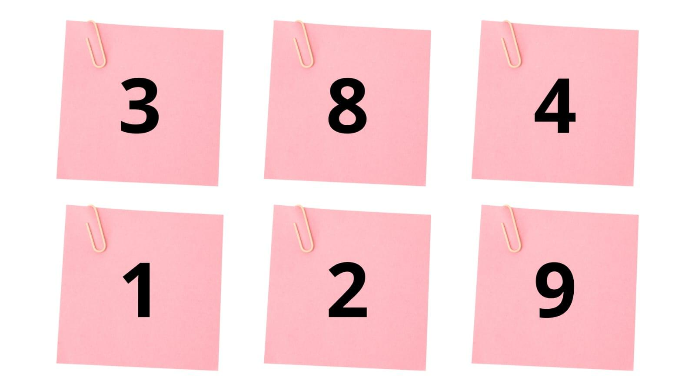

Susun kembali urutan angka genap tersebut

- A. 8, 4, 3
- B. 9, 8, 3
- **C. 8, 4, 2 ✓**
- D. 8, 2, 6

---

### Soal 4
**Fokus pada huruf ganjil dari kiri ke kanan**

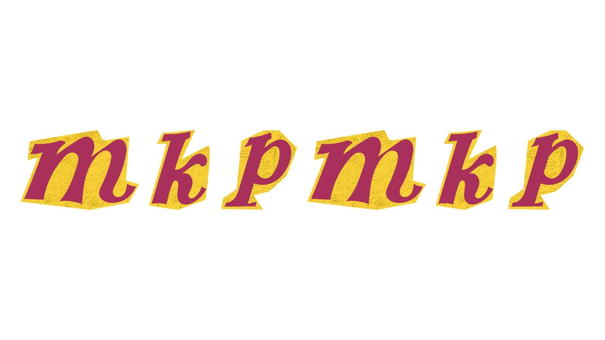

- A. M, K, P
- B. K, P, M
- **C. M, P, K ✓**
- D. P, M, K

---

### Soal 5
**Fokus pada huruf ke 2 sampai ke 4**

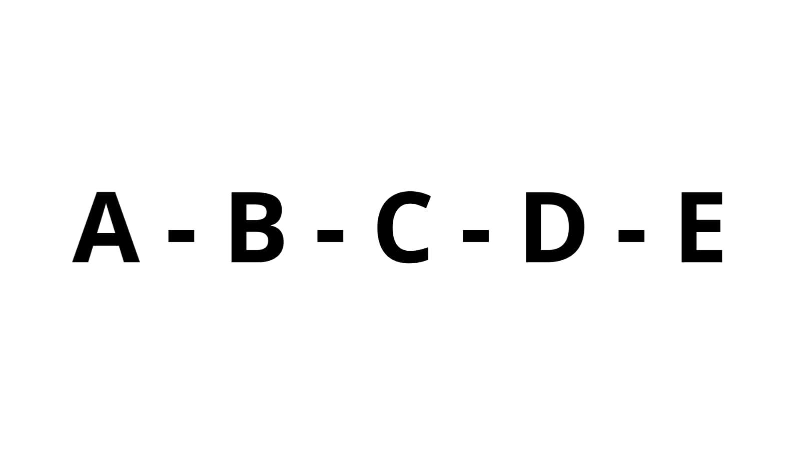

- A. A, B, C
- **B. B, C, D ✓**
- C. C, D, E
- D. A, C, E

---

### Soal 6
**Fokus pada huruf setelah P**

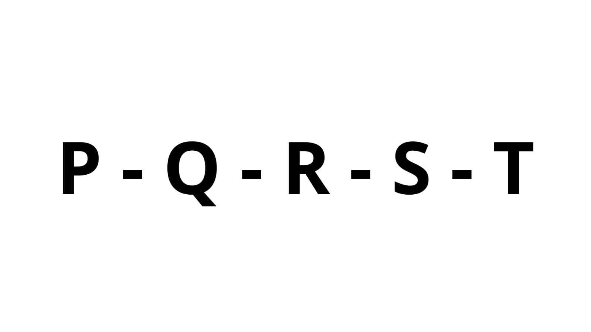

- A. P, Q, R
- B. Q, R, S
- **C. Q, R, S, T ✓**
- D. R, S, T

---

### Soal 7
**Fokus pada huruf sebelum O**

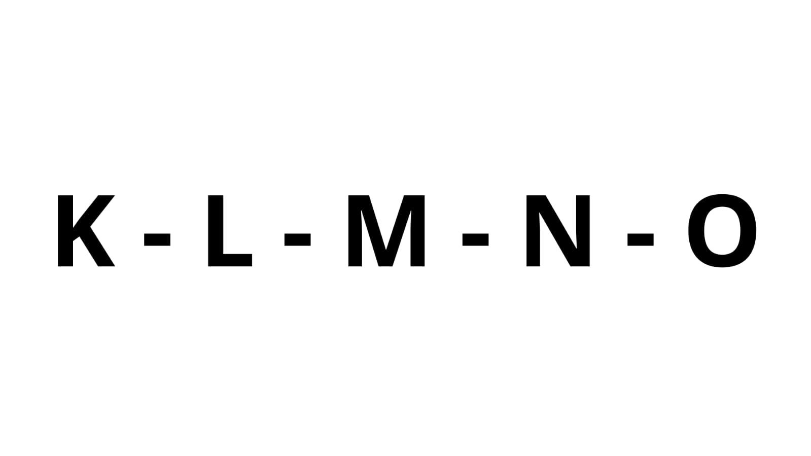

- A. K, L, M
- B. L, M, N
- **C. K, L, M, N ✓**
- D. M, N, O

---

### Soal 8
**Fokus pada huruf di tengah**

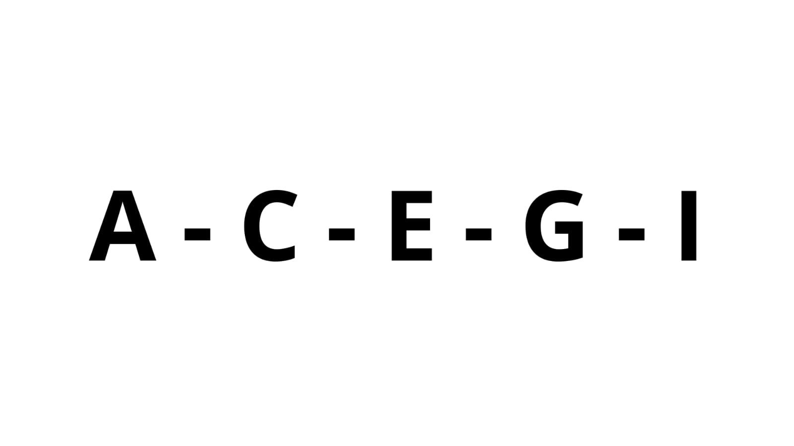

- A. C
- **B. E ✓**
- C. G
- D. I

---

### Soal 9
**Fokus pada dua huruf terakhir**

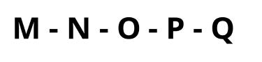

- A. O, P
- **B. P, Q ✓**
- C. N, O
- D. M, N

---

### Soal 10
**Fokus pada huruf ke 1 dan ke 5**

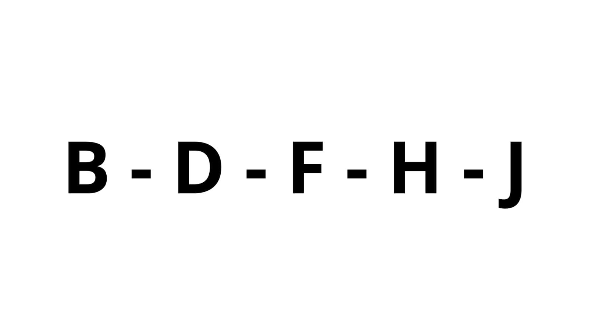

- A. B, D
- B. D, J
- **C. B, J ✓**
- D. F, H

---

## LEVEL 3

> **Instruksi:** "Perhatikan posisi benda pada gambar berikut selama 6 detik!"

---

### Soal 1
**Dimana posisi mobil?**

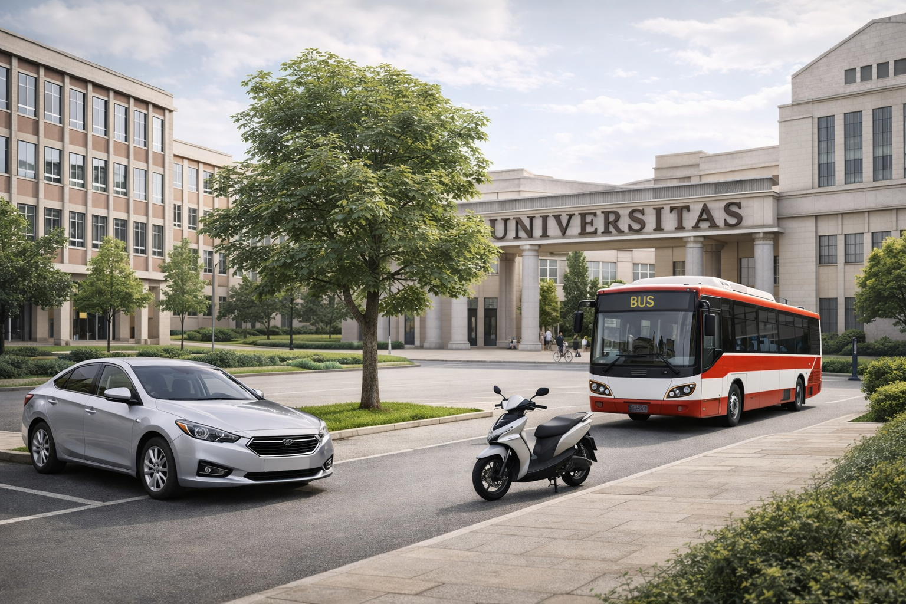

- **A. Di sebelah kiri depan gedung ✓**
- B. Di sebelah kanan dekat bus
- C. Di belakang pohon dekat trotoar
- D. Di belakang bus dekat halte

---

### Soal 2
**Dimana posisi botol air pada gambar tersebut?**

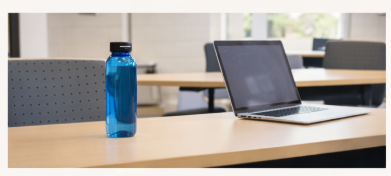

- A. Di atas meja dekat kursi
- B. Di depan laptop dekat mouse
- **C. Di atas meja dekat laptop ✓**
- D. Di kanan laptop dekat buku

---

### Soal 3
**Dimana posisi buku pada gambar tersebut?**

- A. Di sebelah kanan laptop
- **B. Di sebelah kiri laptop ✓**
- C. Di belakang laptop
- D. Di depan laptop

---

### Soal 4
**Objek apa yang berada di kanan pohon?**

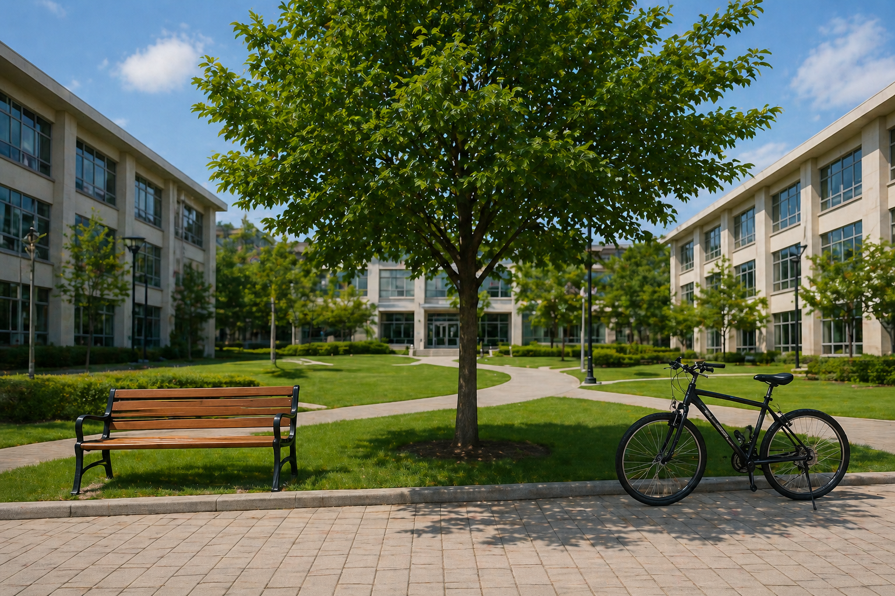

- A. Bangku
- B. Gedung
- **C. Sepeda ✓**
- D. Lampu

---

### Soal 5
**Dimana posisi sepeda motor?**

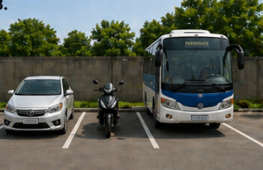

- A. Di kiri mobil dekat trotoar
- **B. Di antara mobil dan bus ✓**
- C. Di belakang bus dekat area parkir
- D. Di depan bus dekat mobil

---

### Soal 6
**Apa yang berada di sisi kanan papan tulis?**

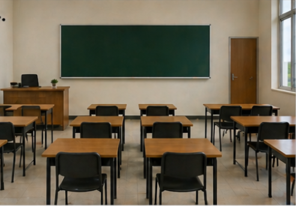

- A. Rak Buku
- B. Jam
- **C. Pintu ✓**
- D. Jendela

---

### Soal 7
**Dimana posisi lampu?**

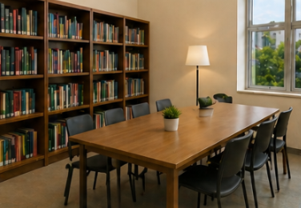

- A. Di kiri rak
- **B. Di kanan meja ✓**
- C. Di depan rak
- D. Di atas meja

---

### Soal 8
**Objek apa yang berada jauh dari laptop?**

- A. Buku
- B. Mouse
- **C. Hiasan Tanaman ✓**
- D. Meja

---

### Soal 9
**Objek apa yang berada paling dekat dengan meja makan pada sisi belakang gambar?**

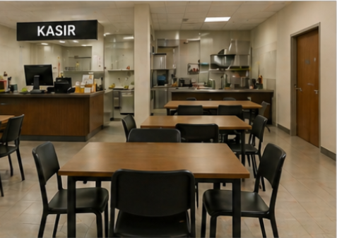

- A. Kasir
- **B. Dapur ✓**
- C. Kursi
- D. Pintu

---

### Soal 10
**Dimana posisi pohon?**

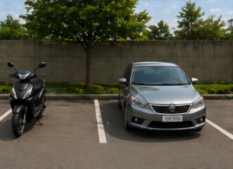

- **A. Di belakang motor dan mobil ✓**
- B. Di depan bus dan dekat area parkir
- C. Di kanan mobil dekat trotoar
- D. Di kiri motor dekat lampu jalan
